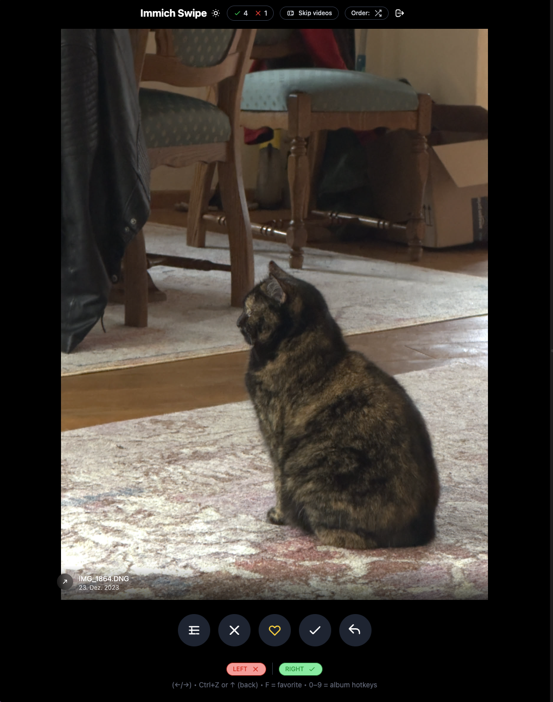
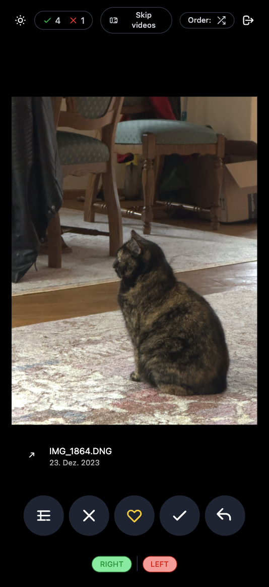
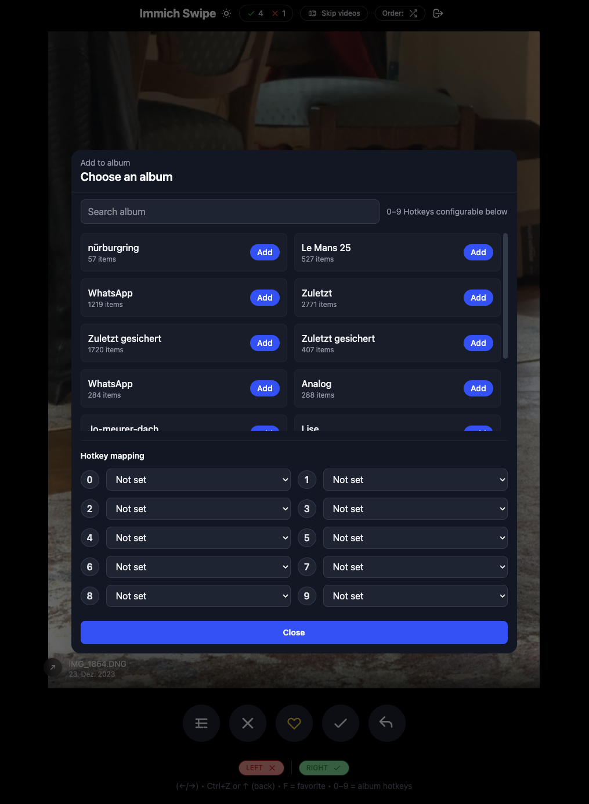

# Immich Swipe

Swipe-review your Immich library: right = keep, left = trash. Like a dating app, but for photos (and videos).


<p align="center">
  
</p>

<p align="center">
  
</p>

<p align="center">
  
</p>

> Screenshots are sanitized (no real photos or API keys).

## Features

- Swipe (touch/mouse) or use keyboard/buttons
- Random or chronological review (oldest/newest first)
- Skip videos toggle
- Favorite toggle (press `F`)
- Add-to-album (+ configurable `0–9` hotkeys)
- Undo (Ctrl/⌘+Z or ↑)
- Reviewed cache + stats persisted per server/user
- Preloads the next asset

## Controls

| Action | Gesture / Key | Button |
|---|---|---|
| Keep | Swipe right / `→` | ✓ |
| Delete (moves to trash) | Swipe left / `←` | ✕ |
| Undo | `Ctrl/⌘+Z` or `↑` | ↶ |
| Favorite | `F` | ♡ |
| Add to album | `0–9` (configured) | Album icon |

## Quickstart

### Local development

```bash
npm install
npm run dev
```

Open `http://localhost:5173`.

### Docker (recommended)

```bash
cp env.example .env
# edit .env (set your Immich server URL and API key)
docker compose up --build
```

Open `http://localhost:2293`.

All configuration is read at **runtime** by the Go backend — no rebuild needed for `.env` changes. Just restart the container.

### GitHub Pages / SPA-only mode

The app can also run as a pure SPA (no Go backend) behind an Nginx reverse proxy. This repo includes a GitHub Actions workflow (`deploy-gh-pages.yml`) that deploys to GitHub Pages on every push to `main`.

In SPA-only mode, API keys are stored in `localStorage` and the browser calls Immich directly.

## Configuration

### Option A: `.env` with Go backend (Docker)

The Go backend reads runtime environment variables (no rebuild needed):

```bash
IMMICH_SERVER_URL=https://immich.example.com
IMMICH_API_KEY_1_NAME=Alice
IMMICH_API_KEY_1_KEY=your-api-key-here
```

Behavior:
- 1 user configured: auto-login
- >1 users configured: user selection screen (`/select-user`)
- no API keys configured: login screen (`/login`) with Immich account or API key

Env API keys are optional. Households can skip them and use Immich email/password login instead.

### Option B: Immich account or API key login

On `/login` you can choose:

1. **Immich account** (email + password + server URL)  
   - The Go backend calls Immich password login and stores the Immich access token server-side  
   - Requires password login enabled on Immich (`passwordLogin.enabled`)  
   - Multiple people can each sign in with their own Immich account on the same deployment

2. **API key** (server URL + API key)  
   - Same as before; useful for private/single-user setups or when password login is disabled

Only the opaque Swipe session token is kept in `sessionStorage` (cleared on tab close). Immich passwords and access tokens never leave the backend.

From the multi-user picker (`/select-user`), use **Sign in with Immich account** for people who are not listed in env keys.

### Option C: SPA-only mode

In SPA-only / GitHub Pages mode (no Go backend), API keys are stored in `localStorage` and the browser calls Immich directly. Credential login requires the Go backend.

## Architecture

The app uses a **Go backend** that serves static files and proxies all Immich API requests:

```
Browser → Go backend (port 8080) → Immich server
         ↕
    sessionStorage (session token)
```

- Immich API keys and access tokens stay **server-side** — never in the browser
- Proxy auth depends on session mode: `x-api-key` (API-key login) or Immich `Authorization: Bearer` (account login)
- The browser's Swipe session Bearer is never forwarded to Immich
- No CORS configuration needed
- Session tokens with 24h sliding expiry

The frontend (Vue 3 SPA) authenticates via the backend and all API calls go through the reverse proxy.

## Stored data (localStorage / sessionStorage)

- `immich-swipe-session` (sessionStorage — session token from Go backend)
- `immich-swipe-theme`
- `immich-swipe-skip-videos`
- `immich-swipe-stats:<server>:<user>` (keep/delete counters)
- `immich-swipe-reviewed:<server>:<user>` (already reviewed IDs + decision)
- `immich-swipe-preferences:<server>:<user>` (order mode + album hotkeys)

## Immich API key permissions

Minimum:
- `asset.read`
- `asset.delete`

If you want albums and favorites, grant the corresponding read/update permissions as well.

## Development scripts

- `npm run dev` (Vite, `5173`, `--host`)
- `npm run build`
- `npm run preview`
- `npm run type-check`
- `npm test`
