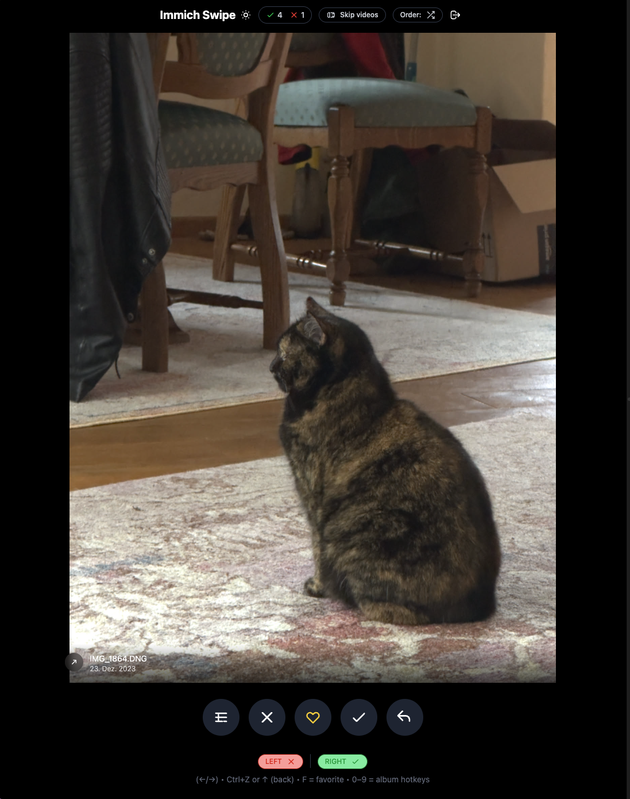
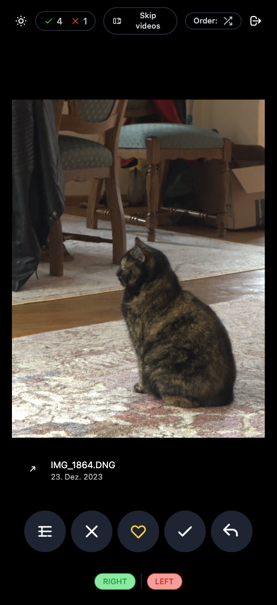
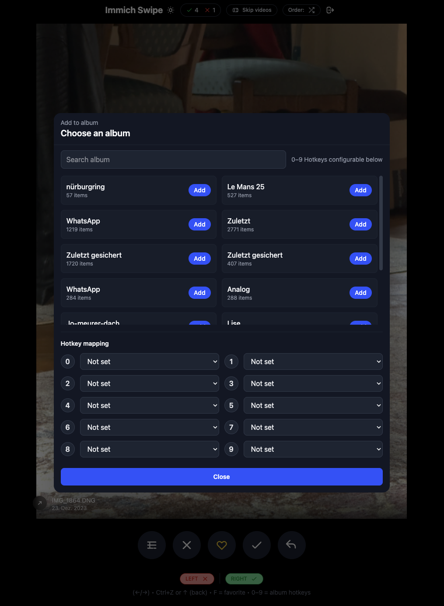

# Immich Swipe

Swipe-review your Immich library: right = keep, left = trash. Like a dating app, but for photos (and videos).


<p align="center">
  
</p>

<p align="center">
  
</p>

<p align="center">
  
</p>

> Screenshots are sanitized (no real photos or API keys).

## Features

- Swipe (touch/mouse) or use keyboard/buttons
- Random or chronological review (oldest/newest first)
- Skip videos toggle
- Favorite toggle (press `F`)
- Add-to-album (+ configurable `0–9` hotkeys)
- Undo (Ctrl/⌘+Z or ↑)
- Reviewed cache + stats persisted per server/user
- Preloads the next asset
- Optional self-hosted analytics (Umami) + OpenTelemetry browser traces/stats, configured in-app under **Settings**

## Controls

| Action | Gesture / Key | Button |
|---|---|---|
| Keep | Swipe right / `→` | ✓ |
| Delete (moves to trash) | Swipe left / `←` | ✕ |
| Undo | `Ctrl/⌘+Z` or `↑` | ↶ |
| Favorite | `F` | ♡ |
| Add to album | `0–9` (configured) | Album icon |

## Quickstart

### Local development

```bash
npm install
npm run dev
```

Open `http://localhost:5173`.

### Docker (recommended)

```bash
cp env.example .env
# edit .env (set your Immich server URL and API key)
docker compose up --build
```

Open `http://localhost:2293`.

All configuration is read at **runtime** by the Go backend — no rebuild needed for `.env` changes. Just restart the container.

### GitHub Pages / SPA-only mode

The app can also run as a pure SPA (no Go backend) behind an Nginx reverse proxy. This repo includes a GitHub Actions workflow (`deploy-gh-pages.yml`) that deploys to GitHub Pages on every push to `main`.

In SPA-only mode, API keys are stored in `localStorage` and the browser calls Immich directly.

## Configuration

### Option A: `.env` with Go backend (Docker)

The Go backend reads runtime environment variables (no rebuild needed):

```bash
IMMICH_SERVER_URL=https://immich.example.com
IMMICH_API_KEY_1_NAME=Alice
IMMICH_API_KEY_1_KEY=your-api-key-here
```

Behavior:
- 1 user configured: auto-login
- >1 users configured: user selection screen (`/select-user`)
- no API keys configured: login screen (`/login`) with Swipe account, Immich account, or API key

Env API keys are optional. Households can skip them and use Immich email/password login instead.

### Local Swipe accounts (optional)

Every person can give their own account a password once logged in: **Settings → Account password**. The password is stored PBKDF2-hashed in the sessions database (`IMMICH_SESSIONS_DB`) and is never sent to Immich.

- Env-configured users are **migrated into local accounts automatically** at startup — existing API keys keep working, nothing to reconfigure.
- Until a password is set, those accounts keep the existing auto-login / user-picker behavior.
- Once a password is set, that account can only be signed in with **user name + password** on `/login` (the auto-login for that account is disabled).
- A local account login uses the account's Immich API key server-side, exactly like an env-key login — the browser never sees it.

Optional runtime variables:
- `TRMNL_STATS_FILE` — path to persist keep/delete counters (see below)
- `IMMICH_SESSIONS_DB` — path to a SQLite file that persists login sessions across restarts (see [Session persistence](#session-persistence))

### Option D: Trmnl e-ink display (keep/delete stats)

A Trmnl e-ink plugin in [`trmnl/`](trmnl/) turns any [Trmnl](https://usetrmnl.com) device into a wall display of your swipe statistics. The Go backend counts actions as they flow through its reverse proxy and exposes them on a public polling endpoint.

**Install**

1. Copy the contents of [`trmnl/`](trmnl/) (a `settings.yml` plus four Liquid layouts) into your own Trmnl plugin.
2. Point the plugin's `polling_url` at your instance: `https://<host>/api/trmnl/stats`
3. Set `refresh_interval` to how often the display should refresh (default `60` minutes).

The endpoint is unauthenticated on purpose (Trmnl devices have no Immich session) and only exposes aggregate counters — no credentials or asset data.

**What gets counted**

| Action | Counted as |
|---|---|
| Delete (moves to trash) | `deleted` +1 per asset |
| Undo delete (restore) | `deleted` −1 per asset |
| Add to album | `kept` +1 per asset |
| Favorite | `kept` +1 |
| Plain swipe-keep | **not counted** (browser-only, no Immich request) |

Counters are tracked per server/user and aggregated in the endpoint's `users` list.

**Persistence**

Counters live in memory by default and reset when the server restarts. Set `TRMNL_STATS_FILE` to persist them to a JSON file after every counted action:

```bash
TRMNL_STATS_FILE=/data/trmnl-stats.json
```

With Docker Compose, bind-mount a directory and point the variable into it:

```yaml
services:
  immich-swipe:
    volumes:
      - ./data:/data
    environment:
      - TRMNL_STATS_FILE=/data/trmnl-stats.json
```

> **Single-instance assumption:** counters are local to one server instance. Do not run multiple replicas behind a load balancer or the totals will diverge.

### Option B: Immich account or API key login

On `/login` you can choose:

1. **Swipe account** (user name + password + server URL)  
   - Authenticates against the local accounts table (Settings → Account password)  
   - Uses the account's Immich API key server-side — no Immich login round-trip
2. **Immich account** (email + password + server URL)  
   - The Go backend calls Immich password login and stores the Immich access token server-side  
   - Requires password login enabled on Immich (`passwordLogin.enabled`)  
   - Multiple people can each sign in with their own Immich account on the same deployment
3. **API key** (server URL + API key)  
   - Same as before; useful for private/single-user setups or when password login is disabled

Only opaque Swipe session tokens are kept in the browser — Immich passwords and access tokens never leave the backend.

### Multi-person sessions

Multiple people can be **logged in at the same time on one device/browser**. Every signed-in person appears in the header switcher (the user badge): tap to switch between them instantly — no re-entering credentials. Per-person state (stats, reviewed cache, review preferences, observability settings) follows the active person automatically.

- **Add a person**: open the header switcher → **Add person** → sign in via `/login` while the existing sessions stay logged in.
- **Sign out**: open the header switcher → **Sign out** next to a person — only that person is removed; if others remain, the app switches to the next one.
- **Expired sessions**: a dead session (401) is removed automatically and the app falls back to the next logged-in person; when none remain you are sent to the login/selection screen.
- Sessions survive page reloads; the last active person is restored on the next visit.
- Legacy single-session data (`immich-swipe-session` in `sessionStorage`) is migrated automatically on first load.

Security note: keeping sessions in `localStorage` (instead of tab-scoped `sessionStorage`) is what allows instant switching after reloads; it means a successful XSS could read session tokens. Swipe session tokens are opaque, not Immich secrets, and expire server-side after 24h.

From the multi-user picker (`/select-user`), use **Sign in with Immich account** for people who are not listed in env keys.

### Session persistence

Swipe sessions live **in the server's memory by default** and are lost when the server restarts — everyone then has to log in again. To keep all logged-in people signed in across server restarts, point `IMMICH_SESSIONS_DB` at a SQLite file:

```bash
IMMICH_SESSIONS_DB=/data/immich-swipe.db
```

With Docker Compose, bind-mount a directory and point the variable into it:

```yaml
services:
  immich-swipe:
    volumes:
      - ./data:/data
    environment:
      - IMMICH_SESSIONS_DB=/data/immich-swipe.db
```

The backend writes every session (token + Immich API key or access token) through to the database and restores non-expired sessions on startup; the 24h sliding expiry and logouts are persisted too.

> **Security note:** the database file contains Immich credentials in plain text (API keys / access tokens) and PBKDF2-hashed local account passwords. Treat it like a secrets file — keep it inside the container volume with restricted permissions and never commit it. The browser still only ever holds opaque Swipe session tokens.


### Option C: SPA-only mode

In SPA-only / GitHub Pages mode (no Go backend), API keys are stored in `localStorage` and the browser calls Immich directly. Credential login requires the Go backend.

## Observability (Settings)

The app ships with **no analytics or tracing enabled by default** — nothing is sent anywhere until you configure it. Open **Settings** (gear icon in the header) to configure two independent integrations, both persisted in `localStorage` per server/user and applied immediately (no reload).

### Umami (self-hosted analytics)

1. Create a website in your Umami instance and copy its **Website ID**.
2. In Settings, enable Umami and enter your Umami server URL (`https://umami.example.com`).
3. Optional **Host URL** (`data-host-url`) if your Umami dashboard runs on a different origin.

The Umami script (`<server>/script.js`) is only injected while enabled. Page views are sent on every route change, plus custom events: `swipe.keep`, `swipe.delete`, `swipe.undo`, `swipe.album_add`, `swipe.person_filter` (each carrying the asset ID/type, album or person name). Events never throw — if the script fails to load the app keeps working normally (status hint shown in Settings).

### OpenTelemetry (traces + stats)

1. Point an OTLP/HTTP collector at the app (see CORS note below).
2. In Settings, enable OpenTelemetry and enter your collector endpoint, e.g. `https://collector.example.com:4318`.
3. Set the trace **sampling** (0–100%). Default 100% samples every trace root; 0% disables traces but metrics are still reported.

Browser-side instrumentation sends:
- **Traces** to `<endpoint>/v1/traces` — every `/api/*` request (including thumbnails and preloads) gets a span; a `swipe.review_action` span is emitted per keep/delete/undo/album action.
- **Metrics** to `<endpoint>/v1/metrics` every 30s — counters `swipe.kept`, `swipe.deleted`, `swipe.undo`, `swipe.album_added` (attrs: `assetType`, `personFiltered`, `albumName`) and `swipe.person_filter` (attr: `personName`).

Service name is `immich-swipe-web`. Trace payloads contain asset IDs and URLs, so only send them to collectors you trust.

**Collector CORS:** browsers enforce CORS on OTLP/HTTP exports. Configure your collector to allow the origin of this app, e.g. for the OTLP HTTP receiver:

```yaml
receivers:
  otlp:
    protocols:
      http:
        cors:
          allowed_origins:
            - "https://your-app.example.com"
```

**Browser-only scope:** the server's own OTel (traces/metrics for the Go backend) is separate and stays configured via `OTEL_*` env vars (see `env.example`). The Settings page only controls browser-side instrumentation.

**Version pinning:** the OTel JS SDK packages are pinned to exact versions in `package.json` (the instrumentation/exporter packages use a different release line than the core SDK). Bump them deliberately as a set.

## Architecture

The app uses a **Go backend** that serves static files and proxies all Immich API requests:

```
Browser → Go backend (port 8080) → Immich server
         ↕
    localStorage (session tokens, multi-person)
```

- Immich API keys and access tokens stay **server-side** — never in the browser
- Proxy auth depends on session mode: `x-api-key` (API-key login) or Immich `Authorization: Bearer` (account login)
- The browser's Swipe session Bearer is never forwarded to Immich
- No CORS configuration needed
- Session tokens with 24h sliding expiry

The frontend (Vue 3 SPA) authenticates via the backend and all API calls go through the reverse proxy.

## Stored data (localStorage / sessionStorage)

- `immich-swipe-sessions` (localStorage — registry of logged-in persons; legacy `immich-swipe-session` in sessionStorage is migrated on first load)
- `immich-swipe-active-session` (localStorage — which person is active, `serverUrl|userName`)
- `immich-swipe-theme`
- `immich-swipe-skip-videos`
- `immich-swipe-stats:<server>:<user>` (keep/delete counters)
- `immich-swipe-reviewed:<server>:<user>` (already reviewed IDs + decision)
- `immich-swipe-preferences:<server>:<user>` (order mode + album hotkeys)
- `immich-swipe-observability:<server>:<user>` (Umami + OpenTelemetry settings)

## Immich API key permissions

Minimum:
- `asset.read`
- `asset.delete`

If you want albums and favorites, grant the corresponding read/update permissions as well.

## Development scripts

- `npm run dev` (Vite, `5173`, `--host`)
- `npm run build`
- `npm run preview`
- `npm run type-check`
- `npm test`
